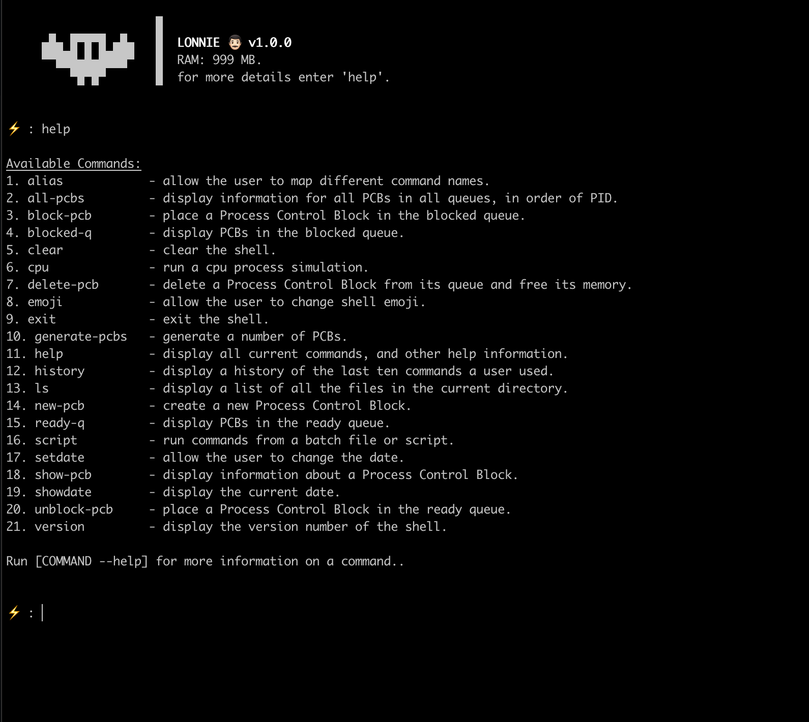

# LonnieOS



## Run Operating System Simulator

```shell
python shell.py
```

## Project File Structure

- classes/       (all custom classes. PCBS, PROCESS etc)
- tests/         (unit testing framework being used - 'unittest')
- memory.json    (manual operating system memory overwrite)
- shell.py       (main file)
- shellConfig.py (shell configuration and helper functions)
- main.py        (all user-accessible functions)

### File structure 

```txt

shellConfig.py     classes/
    |               |   |
    |-------|-------|   |
            |          os.py
            |           |
          tests/   shellConfig.py
            |           |
            |         main.py
            |           |
            |           |
            --------> shell.py
```


[user manual pdf](Lonnie%20Operating%20System%20Manual.pdf)
